# 实验室设备与耗材管理系统需求分析文档

本项目面向高校实验室场景，覆盖设备、耗材、危化品、库存、借还、维修、校准、提醒、报表和权限控制等核心能力。

当前技术栈：
- 后端：Spring Boot 3、Spring Security、JWT、MyBatis-Plus
- 前端：Vue 3、TypeScript、Element Plus、ECharts、Vite
- 数据库：MySQL 8
- 缓存：Redis 7

## 系统入口

| 入口 | 地址 |
|------|------|
| 前端 | `http://127.0.0.1:5173` |
| 后端 API | `http://127.0.0.1:8080/api` |
| Swagger 文档 | `http://127.0.0.1:8080/swagger-ui.html` |

## 系统目标

- 建立设备、耗材、危化品统一台账
- 支持设备借用、归还、维修、校准等完整流程
- 支持耗材入库、出库、库存预警和成本统计
- 支持危化品入库、领用、归还、废液处理和安全追踪
- 支持基于角色的权限控制（RBAC），菜单级与按钮级权限
- 支持通知提醒、操作审计和报表导出

## 用户角色分析

| 角色 | 角色编码 | 主要职责 |
|------|----------|----------|
| 系统管理员 | `sys_admin` | 管理用户、角色、菜单权限、系统配置和审计日志 |
| 实验室主任 | `lab_director` | 统筹本实验室设备、耗材、危化品、安全、审批、提醒处理和统计数据 |
| 教师 | `teacher` | 发起设备借用、耗材申领、危化品使用、故障上报等业务申请，并对学生申请提供业务来源 |
| 学生 | `student` | 在授权范围内提交借用和申领申请，使用过程接受教师或实验室主任监管 |

当前系统默认启用 4 类角色：`sys_admin`、`lab_director`、`teacher`、`student`。虽然角色数量控制为 4 类，但系统业务不再按模块孤立运行，而是按“申请人 -> 审批人 -> 执行人/核验人 -> 提醒接收人”的协同链路组织。

### 角色协同原则

1. 教师和学生负责发起业务申请，申请记录必须带有用途、来源说明和责任人信息。
2. 实验室主任负责审批、核验、异常转办和提醒处理，是跨模块协同的关键角色。
3. 系统管理员负责全局权限、数据治理和跨实验室监督，不直接替代业务来源责任人。
4. 任一业务记录都应能追溯到“谁发起、谁审批、谁执行、谁接收提醒、依据什么来源产生”。
5. 借用、维修、校准、提醒之间必须可联动，不能只保留各自模块内部状态。

## 功能需求

| 模块 | 功能需求 |
|------|----------|
| 登录认证 | 用户名密码登录、JWT 鉴权、登录状态恢复 |
| 权限管理 | 角色、菜单、按钮权限控制 |
| 用户管理 | 用户新增、编辑、停用、角色分配、密码重置 |
| 实验室管理 | 实验室基础信息维护、状态管理、负责人绑定 |
| 设备管理 | 设备分类、设备台账、设备状态、校准周期维护 |
| 设备借用 | 借用登记、审批关联、归还登记、状态更新、逾期催还、归还异常转维修 |
| 设备维修 | 报修、维修状态更新、费用和结果登记、借用异常来源关联、维修后回传校准 |
| 设备校准 | 校准任务、证书编号、校准结果和有效期维护、到期提醒联动、借用可用性控制 |
| 耗材管理 | 耗材分类、耗材台账、安全库存和有效期维护 |
| 耗材入库 | 批次、数量、单价、供应商、生产日期、有效期、来源单位记录 |
| 耗材出库 | 库存批次选择、出库数量校验、金额计算、申请人/审批人/操作人链路记录 |
| 危化品管理 | CAS 编号、危险类别、MSDS 编号、储存位置维护 |
| 危化品使用 | 入库、领用、归还、废液处理、余量记录、双人复核和教师来源绑定 |
| 库存管理 | 统一库存、批次库存、安全库存预警、过期预警 |
| 通知提醒 | 校准到期、耗材过期、设备逾期催还通知、待办责任人提示、来源链路展示 |
| 报表统计 | 设备借用、维修、校准、耗材出库、危化品使用统计 |
| 审计日志 | 关键业务操作记录和追踪 |

### 来源字段要求

1. 申请类数据至少记录申请人、用途、业务日期、来源说明。
2. 审批类数据至少记录审批人、审批结果、审批时间或审批依据。
3. 执行类数据至少记录操作人、执行时间、执行结果。
4. 提醒类数据至少记录发送人、接收人、关联业务类型、关联业务主键。
5. 批次类数据至少记录来源单位、批号、数量、时间和去向。

## 非功能需求

| 类型 | 需求说明 |
|------|----------|
| 安全性 | 密码加密存储，接口鉴权，权限分级控制，生产环境强密钥 |
| 可维护性 | 前后端分离，模块化接口，统一 CRUD 结构 |
| 可扩展性 | 支持扩展审批流、附件管理、盘点管理、消息推送 |
| 可追溯性 | 借还、出入库、危化品使用、维修、校准均保留历史记录 |
| 数据一致性 | 外键、唯一约束、检查约束和触发器维护数据一致性 |
| 上线要求 | 初始化库不含业务演示数据，只保留角色、菜单和权限配置 |

## 核心业务流程

### 设备借用与归还

1. 教师或学生作为申请人选择可用设备，填写借用用途、借用时间、应还时间和来源说明。
2. 系统校验设备状态为“可用”，并确认应还时间晚于借用时间。
3. 实验室主任作为审批人确认借用是否成立，必要时补充审批依据。
4. 审批通过后生成借用记录，系统将设备状态更新为“借用中”。
5. 若借用逾期，系统向申请人发送催还通知，同时在提醒中心显示接收人、发送人和关联借用记录。
6. 归还时由实验室主任或管理员进行归还核验，记录检查结果和来源依据。
7. 若归还检查异常，则同一设备直接转入维修协同流程；若无异常，则设备恢复为“可用”。

### 耗材入库与出库

1. 实验室主任登记入库批次、数量、单价、供应商、生产日期、有效期和来源单位。
2. 系统自动新增或更新库存批次，并保留入库操作人与来源说明。
3. 教师或学生提交出库申请，说明用途与申请来源。
4. 实验室主任审批后选择可用批次，必要时指定实际出库操作人。
5. 系统校验数量不超过可用库存，并自动计算金额与批次去向。
6. 出库完成后保留申请人、审批人、操作人三方链路；库存不足或临期时触发提醒。

### 危化品使用

1. 教师发起危化品申请；学生申请时必须绑定指导教师，确保来源责任明确。
2. 实验室主任核对库存、资质和安全培训状态，并完成审批。
3. 审批通过后登记操作人和复核人，形成“申请人 -> 审批人 -> 操作人 -> 复核人”链路。
4. 使用结束后登记余量归还、包装回收或废液处理，并记录见证人。
5. 系统根据动作类型更新批次库存，并保留完整流转来源。

### 设备维修

1. 教师、学生或实验室主任可发起故障报修，必须填写故障描述、时间和来源说明。
2. 报修来源可来自借用归还异常、日常点检或现场使用反馈。
3. 实验室主任锁定设备状态为“维修中”，并分派处理人。
4. 处理人更新维修过程、费用、结果和结束时间。
5. 维修完成后，结果需回传给原报修链路；若与借用相关，还需反馈给申请人和实验室主任。
6. 若维修后仍需检测，则继续转入校准协同流程；若失败，则进入报废评估。

### 设备校准

1. 实验室主任根据年度计划、维修复检或提醒到期创建校准任务。
2. 记录证书编号、校准日期、有效期和来源说明，并校验有效期晚于校准日期。
3. 设备状态更新为“校准中”，借用可用性同步受控。
4. 校准确认人录入结果，形成“任务发起 -> 校准确认 -> 借用影响 -> 提醒更新”的闭环。
5. 若校准不合格，则限制借用或转入维修；若校准合格，则更新最近校准日期和下次校准日期。

---

## 用例说明书

### 表 1 “设备借用与归还”用例

| 项目 | 内容 |
|------|------|
| 用例名称 | 设备借用与归还 |
| 参与者 | 教师、学生、实验室主任 |
| 前置条件 | 1. 申请人已完成登录并具备设备借用权限；<br>2. 系统已维护实验室、设备分类和设备台账；<br>3. 待借用设备状态为“可用”；<br>4. 申请记录必须填写用途、业务时间和来源说明。 |
| 后置条件 | 1. 系统生成包含申请人、审批人和来源说明的借用记录；<br>2. 审批通过后设备状态更新为“借用中”；<br>3. 归还核验完成后设备恢复“可用”或转入维修；<br>4. 逾期时系统生成可追溯催还通知。 |
| 基本事件流 | 1. 教师或学生进入设备借用页面，查看设备名称、状态、校准信息和实验室归属。<br>2. 申请人选择设备并填写借用用途、借用时间、应还时间和来源说明。<br>3. 系统校验设备当前状态必须为“可用”，且应还时间不得早于借用时间。<br>4. 实验室主任作为审批人查看申请内容、来源依据和申请责任人。<br>5. 审批通过后系统生成借用记录，写入申请人、审批人和用途信息，并将设备状态更新为“借用中”。<br>6. 借用期间若接近到期或已逾期，系统向申请人发送催还通知，并在提醒中心展示发送人、接收人和关联借用记录。<br>7. 归还时由实验室主任或管理员录入归还检查结果与来源依据。<br>8. 若归还正常，系统恢复设备状态为“可用”；若归还异常，则同步转入设备维修流程。 |
| 其他事件流 | A. 申请人提交前返回列表：系统不保存未提交内容。<br>B. 审批人要求补充说明：申请保持待处理状态，申请人补充来源或用途后重新提交。<br>C. 申请人提前归还：系统允许实际归还时间早于应还时间并保留记录。<br>D. 借用逾期：提醒中心新增催还通知，并保留发送人和接收人。 |
| 异常事件流 | A. 设备已被借用或处于维修、校准状态：系统阻止提交申请。<br>B. 借用时间或应还时间不合法：系统提示修改。<br>C. 申请人权限不足：系统禁止进入提交流程。<br>D. 审批被拒绝：系统记录拒绝原因并保留来源链路。<br>E. 归还验收发现设备损坏：系统记录异常并转入维修协同链。 |
| 用例关系 | 包含“用户登录”“设备状态校验”“审批处理”“归还登记”；扩展“逾期提醒”“设备维修”“设备校准可用性控制”。 |

### 表 1-1 “教师申请设备/耗材/危化品”用例

| 项目 | 内容 |
|------|------|
| 用例名称 | 教师申请设备/耗材/危化品 |
| 参与者 | 教师、实验室主任 |
| 前置条件 | 1. 教师已登录系统；<br>2. 教师账号处于启用状态；<br>3. 系统已维护设备、耗材、危化品和库存台账；<br>4. 教师需填写教学、科研或实验准备等业务来源。 |
| 后置条件 | 1. 系统生成教师申请记录；<br>2. 申请记录保留教师姓名、用途、项目或课程来源；<br>3. 审批通过后进入借用、出库或危化品执行链路；<br>4. 后续提醒、归还、维修或废液处理都能回溯到教师申请。 |
| 基本事件流 | 1. 教师进入设备借用、耗材申领或危化品使用页面。<br>2. 教师选择目标设备、耗材批次或危化品批次。<br>3. 教师填写用途、课程名称、科研项目或实验准备来源。<br>4. 系统校验资源状态和教师权限。<br>5. 实验室主任审核教师申请，并记录审批意见。<br>6. 审批通过后，系统生成正式业务记录，并把教师设置为申请人。<br>7. 若业务进入归还、催还、维修、校准或废液处理阶段，系统继续沿用该教师申请链路。 |
| 其他事件流 | A. 教师为教学准备批量申领耗材：系统允许同一教师针对多个批次提交申请。<br>B. 教师为学生实验代为申请危化品：系统在备注中保留指导来源。<br>C. 教师申请设备后提前归还：系统保留实际归还时间。 |
| 异常事件流 | A. 教师申请数量超过库存：系统阻止提交。<br>B. 教师选择的设备不可用：系统提示设备状态异常。<br>C. 审批被拒绝：系统记录拒绝原因和原申请来源。 |
| 用例关系 | 包含“设备借用与归还”“耗材入库与出库”“危化品使用”；扩展“到期提醒”“设备维修”“设备校准”。 |

### 表 1-2 “学生申请设备/耗材/危化品”用例

| 项目 | 内容 |
|------|------|
| 用例名称 | 学生申请设备/耗材/危化品 |
| 参与者 | 学生、教师、实验室主任 |
| 前置条件 | 1. 学生已登录系统；<br>2. 学生账号处于启用状态且具备对应申请权限；<br>3. 学生申请必须填写实验用途和来源说明；<br>4. 危化品申请需绑定指导教师或由教师代为说明来源。 |
| 后置条件 | 1. 系统生成以学生为申请人的业务记录；<br>2. 若涉及教师指导，记录中保留教师来源信息；<br>3. 审批通过后进入借用、出库或危化品执行链路；<br>4. 催还、归还异常、废液处理和提醒通知均能回溯到学生申请。 |
| 基本事件流 | 1. 学生进入设备借用、耗材申领或危化品使用页面。<br>2. 学生选择所需设备、批次或危化品。<br>3. 学生填写实验名称、用途、课程或项目来源；必要时补充指导教师信息。<br>4. 系统校验库存、设备状态和学生权限。<br>5. 实验室主任审核学生申请，必要时参考教师来源说明。<br>6. 审批通过后，系统生成正式业务记录，并把学生设置为申请人。<br>7. 若学生借用设备逾期，提醒中心向学生发送催还通知，同时保留审批链路。<br>8. 若学生使用后产生归还异常或危化品废液，系统继续关联到原学生申请记录。 |
| 其他事件流 | A. 学生在教师指导下申请危化品：系统同时记录学生申请人与教师来源。<br>B. 学生申请耗材后只部分领用：系统保留原申请与实际出库差异。<br>C. 学生借用设备后按期归还：系统闭环记录学生申请、主任审批和归还核验。 |
| 异常事件流 | A. 学生未填写来源说明：系统禁止提交。<br>B. 学生申请危化品但缺少教师来源：系统禁止进入审批。<br>C. 学生权限不足或资源不可用：系统阻止提交申请。 |
| 用例关系 | 包含“设备借用与归还”“耗材入库与出库”“危化品使用”；扩展“到期提醒”“设备维修”“设备校准可用性控制”。 |

### 表 2 “耗材入库与出库”用例

| 项目 | 内容 |
|------|------|
| 用例名称 | 耗材入库与出库 |
| 参与者 | 教师、学生、实验室主任 |
| 前置条件 | 1. 参与者已完成登录；<br>2. 系统已维护实验室、耗材分类和耗材台账；<br>3. 入库操作人具备耗材入库权限；<br>4. 出库申请人具备耗材申领权限。 |
| 后置条件 | 1. 入库成功后生成耗材入库记录，并新增或更新库存批次；<br>2. 出库成功后生成耗材出库记录，并扣减对应批次库存；<br>3. 当库存低于安全库存或耗材临期时，系统生成库存预警。 |
| 基本事件流 | 1. 实验室主任进入耗材入库页面，选择耗材名称和所属实验室。<br>2. 管理人填写批次号、入库数量、单价、供应商、生产日期、有效期和备注。<br>3. 系统校验入库数量大于 0、单价不小于 0，并校验有效期不得早于生产日期。<br>4. 校验通过后系统生成入库记录，并按“耗材 + 批次号”新增或更新库存数量。<br>5. 申请人进入耗材出库页面，选择需要申领的耗材和业务用途。<br>6. 系统展示可用库存批次，申请人或实验室主任选择批次并填写出库数量。<br>7. 系统校验出库数量不得超过可用库存，并自动计算出库金额。<br>8. 审批通过或实验室主任确认后，系统生成出库记录，扣减库存批次数量。 |
| 其他事件流 | A. 同一批次重复入库：系统合并更新该批次库存数量，并保留多条入库流水。<br>B. 出库申请尚未审批：记录保持“待审批”状态，不扣减实际库存。<br>C. 出库用途为教学、科研或维护：系统按业务类型记录，便于后续报表统计。 |
| 异常事件流 | A. 入库数量为 0 或负数：系统提示数量不合法，禁止保存。<br>B. 有效期早于生产日期：系统提示日期不合法，要求修改后提交。<br>C. 出库数量超过库存：系统提示库存不足，阻止出库。<br>D. 所选批次已过期：系统提示批次不可用或要求管理员确认后处理。<br>E. 申请被拒绝：系统记录拒绝原因，不扣减库存。 |
| 用例关系 | 包含“耗材台账选择”“库存批次维护”“库存数量校验”；扩展“库存预警”“报表统计”。 |

### 表 3 “危化品使用”用例

| 项目 | 内容 |
|------|------|
| 用例名称 | 危化品使用 |
| 参与者 | 教师、学生、实验室主任 |
| 前置条件 | 1. 申请人已完成登录；<br>2. 系统已维护危化品台账和库存批次；<br>3. 申请人具备危化品领用申请权限；<br>4. 学生申请危化品时需绑定指导教师或由教师代为申请。 |
| 后置条件 | 1. 危化品领用、归还或废液处理记录保存成功；<br>2. 对应危化品库存批次数量完成更新；<br>3. 系统保留申请人、审批人、操作人和复核人信息，满足安全追溯要求。 |
| 基本事件流 | 1. 申请人进入危化品使用页面，选择危化品、批次和业务动作类型。<br>2. 申请人填写使用数量、用途、实验项目、使用日期和备注。<br>3. 系统校验危化品状态、库存数量和申请人权限。<br>4. 实验室主任审核申请，核对库存、安全培训状态和实验用途。<br>5. 审批通过后，由实验室主任登记操作人和复核人，确认实际领用数量。<br>6. 系统生成危化品使用记录，并根据动作类型自动更新库存。<br>7. 使用结束后，申请人或实验室主任登记剩余量归还、包装回收或废液处理信息。<br>8. 系统保留完整流转记录，支持按危化品、批次、日期和人员追溯。 |
| 其他事件流 | A. 危化品仅做采购入库：实验室主任选择“入库”动作，系统增加库存并生成入库类使用记录。<br>B. 使用后存在剩余量：实验室主任选择“归还”动作，填写剩余数量并回补库存。<br>C. 使用后产生废液：实验室主任选择“废液处理”动作，记录废液类别、数量和移交去向。 |
| 异常事件流 | A. 库存不足：系统提示当前批次库存不足，阻止领用。<br>B. 危化品处于停用或受控状态：系统提示需管理员或主任审批。<br>C. 缺少复核人信息：系统提示双人登记信息不完整，禁止完成领用。<br>D. 数量填写为 0 或负数：系统提示数量不合法，阻止提交。<br>E. 审批被拒绝：系统记录拒绝原因，不改变库存。 |
| 用例关系 | 包含“危化品台账选择”“库存批次校验”“审批处理”“双人复核”；扩展“废液处理”“安全审计”。 |

### 表 4 “设备维修”用例

| 项目 | 内容 |
|------|------|
| 用例名称 | 设备维修 |
| 参与者 | 教师、学生、实验室主任 |
| 前置条件 | 1. 报修人已登录系统；<br>2. 系统已存在对应设备台账；<br>3. 设备未处于报废状态；<br>4. 报修记录必须说明故障来源，如借用归还异常、日常点检或现场使用反馈。 |
| 后置条件 | 1. 系统生成包含报修人、处理人和来源说明的维修记录；<br>2. 设备状态更新为“维修中”或“无法修复”；<br>3. 维修结果回传到设备台账，并可继续转入校准；<br>4. 与借用相关的维修能反向追踪到原借用链路。 |
| 基本事件流 | 1. 报修人进入设备维修页面，选择故障设备。<br>2. 报修人填写故障描述、报修时间和来源说明。<br>3. 系统校验设备存在且未报废，保存维修记录。<br>4. 实验室主任确认报修，将设备状态更新为“维修中”。<br>5. 实验室主任分派处理人，记录维修开始时间。<br>6. 处理人录入维修过程、费用、维修结果和结束时间。<br>7. 若该报修来自借用归还异常，系统保留与借用记录的关联。<br>8. 实验室主任验收维修结果，确认通过后恢复设备状态，必要时继续创建校准任务。 |
| 其他事件流 | A. 处理人暂未确定：先保留待处理状态。<br>B. 维修过程中需要更换配件：在维修结果和备注中登记。<br>C. 维修完成后需要重新检测：直接联动进入校准流程。 |
| 异常事件流 | A. 设备不存在：系统提示无法报修。<br>B. 设备已有未完成维修：阻止重复报修。<br>C. 维修结束时间早于开始时间：系统提示时间不合法。<br>D. 维修失败：系统记录结果并进入报废评估或停用状态。 |
| 用例关系 | 包含“设备台账选择”“处理人分派”“维修结果登记”；扩展“设备借用异常转维修”“设备校准”“系统日志”。 |

### 表 5 “设备校准”用例

| 项目 | 内容 |
|------|------|
| 用例名称 | 设备校准 |
| 参与者 | 实验室主任、校准确认人 |
| 前置条件 | 1. 参与者已登录系统；<br>2. 系统已存在设备台账和校准周期配置；<br>3. 校准任务来源于年度计划、维修复检或提醒到期；<br>4. 校准记录必须填写证书编号、日期和来源说明。 |
| 后置条件 | 1. 系统生成设备校准记录；<br>2. 校准完成后保存确认人、证书编号、校准日期、有效期和结果；<br>3. 设备台账更新最近校准日期和下次校准日期；<br>4. 校准结果同步影响借用可用性与提醒中心。 |
| 基本事件流 | 1. 实验室主任进入设备校准页面，选择需要校准的设备。<br>2. 填写证书编号、校准日期、有效期和来源说明。<br>3. 系统校验证书编号唯一，且有效期不得早于校准日期。<br>4. 保存校准记录后，设备状态更新为“校准中”。<br>5. 校准确认人录入校准结果。<br>6. 若结果合格，系统更新下次校准日期并恢复设备借用可用性。<br>7. 若结果不合格，系统限制借用并提示实验室主任继续处理。<br>8. 到期窗口内的设备自动进入提醒中心，形成“提醒 -> 校准 -> 借用影响”的闭环。 |
| 其他事件流 | A. 校准任务提前创建：记录保持待确认状态。<br>B. 校准证书后补：先保留任务，后续补充证书编号。<br>C. 校准来源为维修复检：系统保留与维修记录的关联。 |
| 异常事件流 | A. 证书编号重复：系统禁止保存。<br>B. 有效期早于校准日期：系统提示日期不合法。<br>C. 设备处于报废状态：系统禁止创建校准记录。<br>D. 校准不合格：设备状态转为限制使用、停用或维修评估。 |
| 用例关系 | 包含“设备台账选择”“证书编号校验”“校准结果登记”；扩展“到期提醒”“设备维修”“设备借用可用性控制”。 |

### 表 6 “到期提醒”用例

| 项目 | 内容 |
|------|------|
| 用例名称 | 到期提醒 |
| 参与者 | 系统管理员、实验室主任、教师 |
| 前置条件 | 1. 参与者已完成登录；<br>2. 系统已存在设备校准记录、耗材库存批次或逾期借用记录；<br>3. 系统已配置提醒阈值天数；<br>4. 当前用户具备查看提醒页面与通知列表的权限。 |
| 后置条件 | 1. 页面展示当前用户可见的提醒与通知数据；<br>2. 每条提醒都能看到责任角色、来源类型和关联业务；<br>3. 即将到期的校准和耗材批次形成待办；<br>4. 借用逾期提醒可通过通知列表追踪发送人、接收人和业务主键。 |
| 基本事件流 | 1. 用户进入提醒中心，系统加载“我的通知”“校准协同待办”“耗材批次待办”等数据。<br>2. 系统筛选未来阈值天数内即将到期的设备校准记录，展示设备名称、实验室、到期时间和下一步责任角色。<br>3. 系统筛选未来阈值天数内即将过期的耗材库存批次，展示耗材名称、批号、剩余数量、到期时间和来源依据。<br>4. 用户查看“我的通知”列表，读取通知标题、内容、发送时间、发送人、关联业务类型和关联业务主键。<br>5. 若借用业务中存在逾期记录，实验室主任可发送催还通知，提醒中心同步显示通知链路。<br>6. 用户点击刷新后，系统重新拉取待办和通知数据。 |
| 其他事件流 | A. 当前提醒数据为空：页面显示空状态。<br>B. 仅存在校准或耗材提醒：仅展示对应区域。<br>C. 维修后创建校准任务：提醒中心可继续展示校准待跟进任务。 |
| 异常事件流 | A. 提醒数据加载失败：页面提示加载失败并保留刷新入口。<br>B. 用户无提醒权限：系统拒绝访问。<br>C. 基础数据缺失：系统跳过异常记录或提示数据不完整。 |
| 用例关系 | 包含“用户登录”“提醒规则计算”“通知列表查询”；扩展“设备借用逾期催还”“设备校准”“耗材库存预警”“设备维修后校准跟进”。 |

## 系统总体用例图

下面给出一张覆盖核心功能的系统总体用例图。考虑到当前文档统一使用 `mermaid`，这里采用 `flowchart` 方式模拟 UML 用例图，便于直接在 Markdown 中渲染、截图和继续修改。

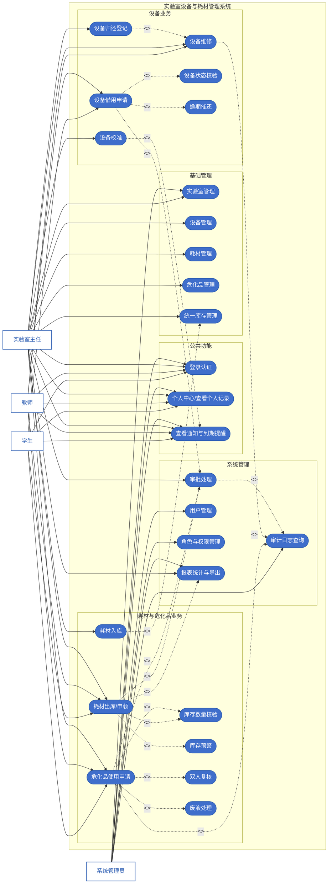

如果老师希望严格使用 UML 用例图符号，也可以基于这份功能清单再拆成 3 张图：

- 业务申请用例图：学生、教师、实验室主任
- 资产与库存管理用例图：实验室主任
- 系统管理用例图：系统管理员

## 概念模型设计（经典 Chen E-R 图）

### 系统总体 E-R 图（实体与联系，不描述属性）

本节采用经典 Chen E-R 模型描述系统概念结构。图中矩形表示实体，菱形表示联系，连线两端标注 `1`、`N`、`M` 表示基数。按照要求，系统总体 E-R 图只描述实体、联系和基数，不在总图中展开属性；各实体属性在后续“各实体属性详细设计”中单独绘制。

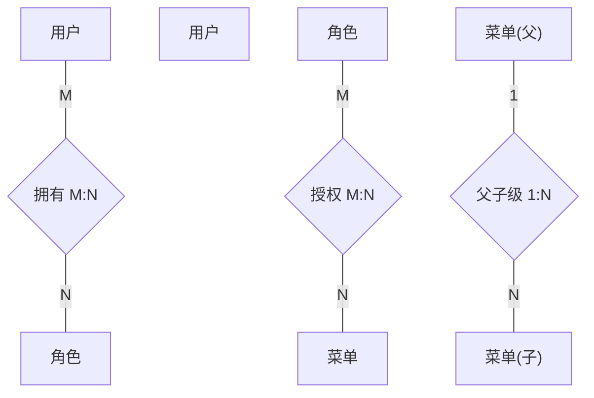

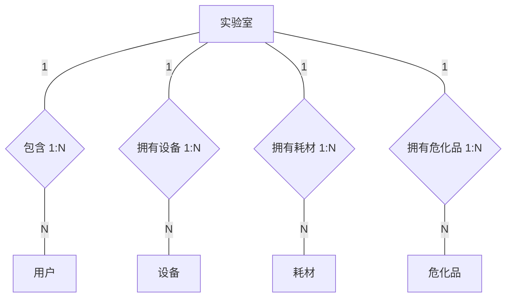

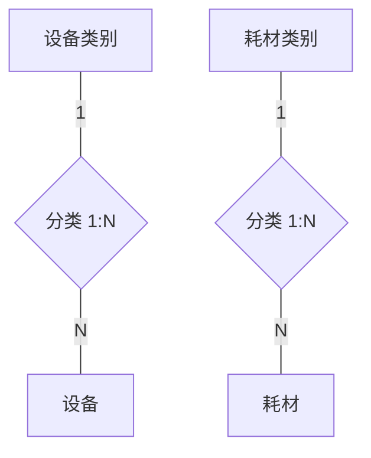


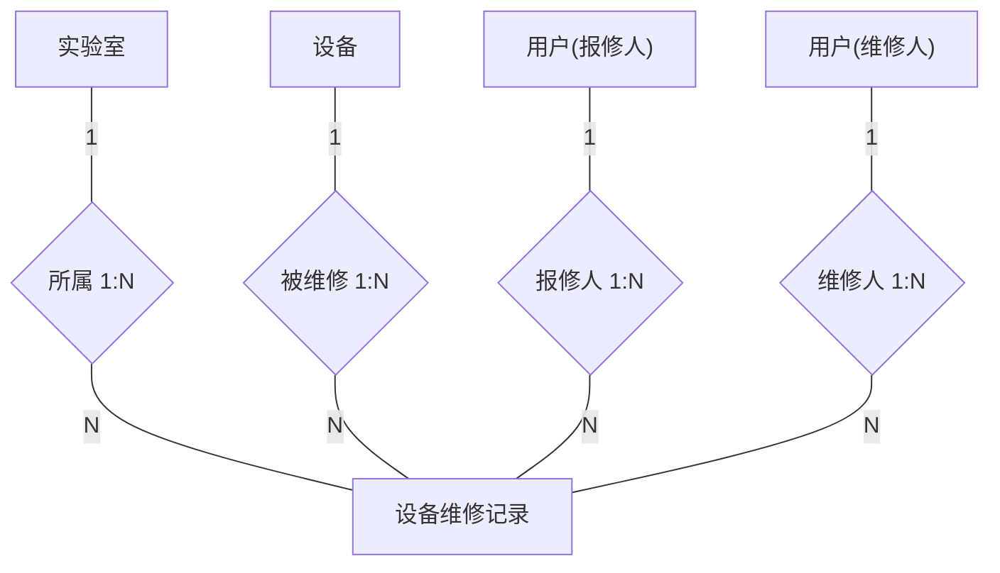

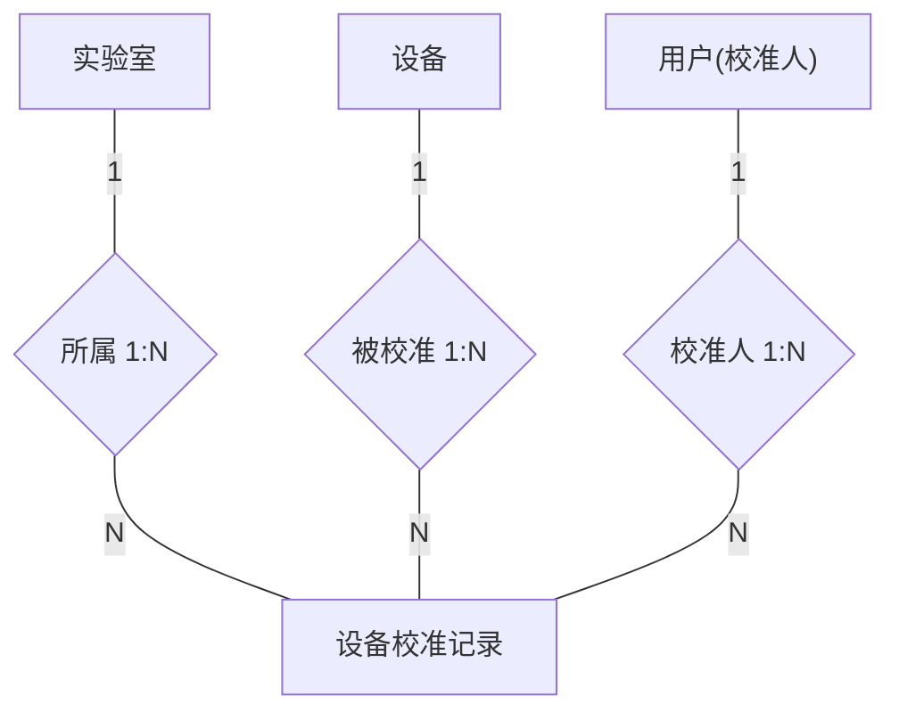

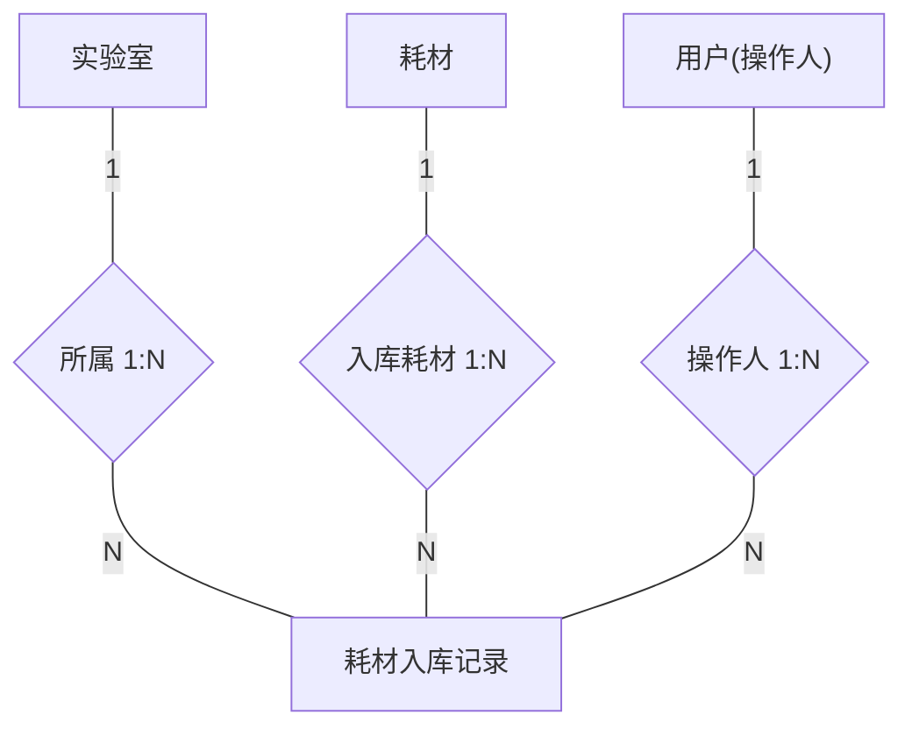

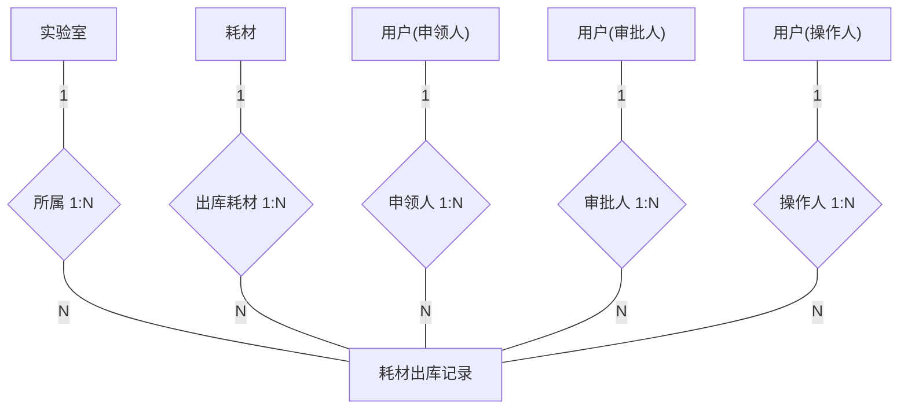

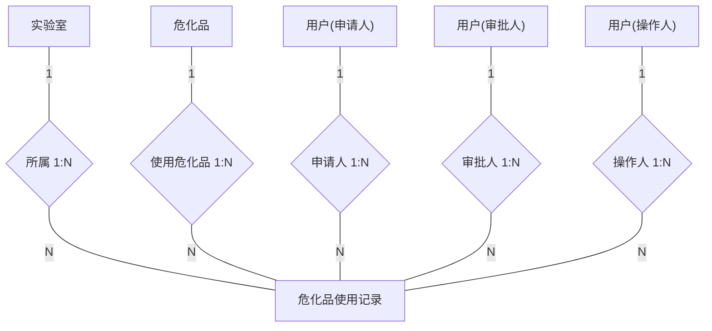

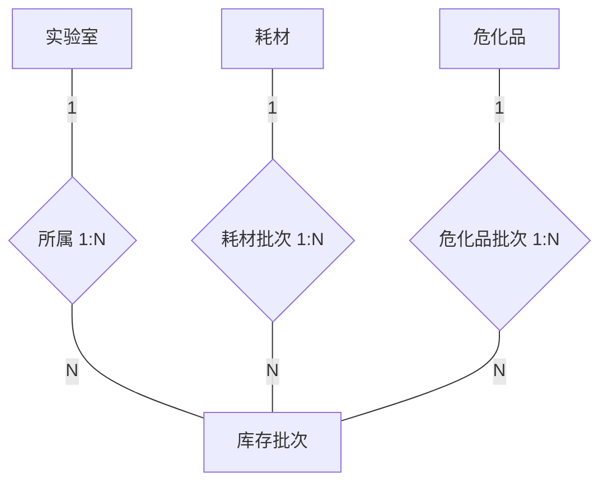

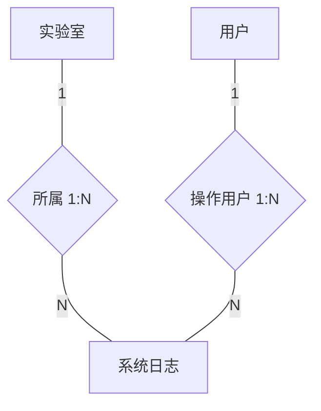

### 全部实体-联系基数汇总

#### 权限与用户

| 实体 A | 实体 B | 联系 | 基数 | 数据库实现字段 |
|--------|--------|------|------|------|
| 用户 | 角色 | 拥有/被分配 | M:N | `user_role` 中间表 |
| 角色 | 菜单 | 授权 | M:N | `role_menu` 中间表 |
| 菜单(父) | 菜单(子) | 父子级 | 1:N | `parent_id` |

#### 实验室与资产

| 实体 A | 实体 B | 联系 | 基数 | 数据库实现字段 |
|--------|--------|------|------|------|
| 实验室 | 用户 | 包含 | 1:N | `laboratory_id` |
| 实验室 | 设备 | 拥有 | 1:N | `laboratory_id` |
| 实验室 | 耗材 | 拥有 | 1:N | `laboratory_id` |
| 实验室 | 危化品 | 拥有 | 1:N | `laboratory_id` |
| 设备类别 | 设备 | 分类 | 1:N | `category_id` |
| 耗材类别 | 耗材 | 分类 | 1:N | `category_id` |
| 用户 | 设备 | 管理 | 1:N | `manager_user_id` |
| 用户 | 耗材 | 管理 | 1:N | `manager_user_id` |
| 用户 | 危化品 | 管理 | 1:N | `manager_user_id` |

#### 设备借用

| 实体 A | 实体 B | 联系 | 基数 | 数据库实现字段 |
|--------|--------|------|------|------|
| 设备 | 设备借用记录 | 被借用 | 1:N | `equipment_id` |
| 实验室 | 设备借用记录 | 所属 | 1:N | `laboratory_id` |
| 用户 | 设备借用记录 | 借用人 | 1:N | `borrower_user_id` |
| 用户 | 设备借用记录 | 审批人 | 1:N | `approver_user_id` |

#### 设备维修

| 实体 A | 实体 B | 联系 | 基数 | 数据库实现字段 |
|--------|--------|------|------|------|
| 设备 | 设备维修记录 | 被维修 | 1:N | `equipment_id` |
| 实验室 | 设备维修记录 | 所属 | 1:N | `laboratory_id` |
| 用户 | 设备维修记录 | 报修人 | 1:N | `reporter_user_id` |
| 用户 | 设备维修记录 | 维修人 | 1:N | `repair_user_id` |

#### 设备校准

| 实体 A | 实体 B | 联系 | 基数 | 数据库实现字段 |
|--------|--------|------|------|------|
| 设备 | 设备校准记录 | 被校准 | 1:N | `equipment_id` |
| 实验室 | 设备校准记录 | 所属 | 1:N | `laboratory_id` |
| 用户 | 设备校准记录 | 校准人 | 1:N | `calibration_user_id` |

#### 耗材入库

| 实体 A | 实体 B | 联系 | 基数 | 数据库实现字段 |
|--------|--------|------|------|------|
| 耗材 | 耗材入库记录 | 入库 | 1:N | `consumable_id` |
| 实验室 | 耗材入库记录 | 所属 | 1:N | `laboratory_id` |
| 用户 | 耗材入库记录 | 操作人 | 1:N | `operator_user_id` |

#### 耗材出库

| 实体 A | 实体 B | 联系 | 基数 | 数据库实现字段 |
|--------|--------|------|------|------|
| 耗材 | 耗材出库记录 | 出库 | 1:N | `consumable_id` |
| 实验室 | 耗材出库记录 | 所属 | 1:N | `laboratory_id` |
| 用户 | 耗材出库记录 | 申领人 | 1:N | `applicant_user_id` |
| 用户 | 耗材出库记录 | 审批人 | 1:N | `approver_user_id` |
| 用户 | 耗材出库记录 | 操作人 | 1:N | `operator_user_id` |

#### 危化品使用

| 实体 A | 实体 B | 联系 | 基数 | 数据库实现字段 |
|--------|--------|------|------|------|
| 危化品 | 危化品使用记录 | 使用 | 1:N | `hazardous_material_id` |
| 实验室 | 危化品使用记录 | 所属 | 1:N | `laboratory_id` |
| 用户 | 危化品使用记录 | 申请人 | 1:N | `applicant_user_id` |
| 用户 | 危化品使用记录 | 审批人 | 1:N | `approver_user_id` |
| 用户 | 危化品使用记录 | 操作人 | 1:N | `operator_user_id` |

#### 库存

| 实体 A | 实体 B | 联系 | 基数 | 数据库实现字段 |
|--------|--------|------|------|------|
| 实验室 | 库存批次 | 所属 | 1:N | `laboratory_id` |
| 耗材 | 库存批次 | 耗材批次 | 1:N | `item_id` (item_type=2) |
| 危化品 | 库存批次 | 危化品批次 | 1:N | `item_id` (item_type=3) |

#### 日志

| 实体 A | 实体 B | 联系 | 基数 | 数据库实现字段 |
|--------|--------|------|------|------|
| 实验室 | 系统日志 | 所属 | 1:N | `laboratory_id` |
| 用户 | 系统日志 | 操作用户 | 1:N | `user_id` |

---

## 各实体属性详细设计

### 用户（user）

```mermaid
flowchart TB
    er1_entity["用户"]
    er1_attr1(["id<br/>PK<br/>用户主键 自增"])
    er1_entity --- er1_attr1
    er1_attr2(["laboratory_id<br/>FK<br/>所属实验室ID"])
    er1_entity --- er1_attr2
    er1_attr3(["username<br/>UK<br/>登录用户名 唯一"])
    er1_entity --- er1_attr3
    er1_attr4(["password_hash<br/>密码哈希 BCrypt"])
    er1_entity --- er1_attr4
    er1_attr5(["real_name<br/>真实姓名"])
    er1_entity --- er1_attr5
    er1_attr6(["user_no<br/>工号或学号"])
    er1_entity --- er1_attr6
    er1_attr7(["gender<br/>性别 0未知 1男 2女"])
    er1_entity --- er1_attr7
    er1_attr8(["phone<br/>手机号"])
    er1_entity --- er1_attr8
    er1_attr9(["email<br/>邮箱"])
    er1_entity --- er1_attr9
    er1_attr10(["user_type<br/>用户类型"])
    er1_entity --- er1_attr10
    er1_attr11(["status<br/>状态 0停用 1启用"])
    er1_entity --- er1_attr11
    er1_attr12(["last_login_time<br/>最后登录时间"])
    er1_entity --- er1_attr12
    er1_attr13(["create_time<br/>创建时间"])
    er1_entity --- er1_attr13
    er1_attr14(["update_time<br/>更新时间"])
    er1_entity --- er1_attr14
    er1_attr15(["is_deleted<br/>逻辑删除 0否 1是"])
    er1_entity --- er1_attr15
    classDef entity fill:#f7f7ff,stroke:#333,stroke-width:1.5px;
    classDef attr fill:#fff,stroke:#333,stroke-width:1px;
    class er1_entity entity;
    class er1_attr1,er1_attr2,er1_attr3,er1_attr4,er1_attr5,er1_attr6,er1_attr7,er1_attr8,er1_attr9,er1_attr10,er1_attr11,er1_attr12,er1_attr13,er1_attr14,er1_attr15 attr;
```

| 关联方向 | 关联实体 | 外键字段 | 基数 |
|----------|----------|----------|------|
| → 属于 | 实验室 | `laboratory_id` | N:1 |
| → 管理 | 设备 | `manager_user_id` | 1:N |
| → 管理 | 耗材 | `manager_user_id` | 1:N |
| → 管理 | 危化品 | `manager_user_id` | 1:N |
| → 借用 | 设备借用 | `borrower_user_id` | 1:N |
| → 审批借用 | 设备借用 | `approver_user_id` | 1:N |
| → 报修 | 设备维修 | `reporter_user_id` | 1:N |
| → 维修 | 设备维修 | `repair_user_id` | 1:N |
| → 校准 | 设备校准 | `calibration_user_id` | 1:N |
| → 操作入库 | 耗材入库 | `operator_user_id` | 1:N |
| → 申领出库 | 耗材出库 | `applicant_user_id` | 1:N |
| → 审批出库 | 耗材出库 | `approver_user_id` | 1:N |
| → 操作出库 | 耗材出库 | `operator_user_id` | 1:N |
| → 申请危化品 | 危化品使用 | `applicant_user_id` | 1:N |
| → 审批危化品 | 危化品使用 | `approver_user_id` | 1:N |
| → 操作危化品 | 危化品使用 | `operator_user_id` | 1:N |
| → 产生日志 | 系统日志 | `user_id` | 1:N |
| → 拥有角色 | 用户角色关联 | `user_id` | 1:N |

### 角色（role）

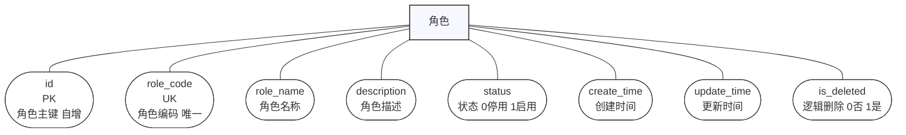

| 关联方向 | 关联实体 | 外键字段 | 基数 |
|----------|----------|----------|------|
| → 被分配 | 用户角色关联 | `role_id` | 1:N |
| → 授权菜单 | 角色菜单关联 | `role_id` | 1:N |

### 菜单（menu）

```mermaid
flowchart TB
    er3_entity["菜单"]
    er3_attr1(["id<br/>PK<br/>菜单主键 自增"])
    er3_entity --- er3_attr1
    er3_attr2(["parent_id<br/>FK<br/>父菜单ID 自引用"])
    er3_entity --- er3_attr2
    er3_attr3(["menu_code<br/>UK<br/>菜单权限编码 唯一"])
    er3_entity --- er3_attr3
    er3_attr4(["menu_name<br/>菜单名称"])
    er3_entity --- er3_attr4
    er3_attr5(["path<br/>前端路由路径"])
    er3_entity --- er3_attr5
    er3_attr6(["component<br/>前端组件路径"])
    er3_entity --- er3_attr6
    er3_attr7(["icon<br/>图标"])
    er3_entity --- er3_attr7
    er3_attr8(["sort_order<br/>排序序号"])
    er3_entity --- er3_attr8
    er3_attr9(["menu_type<br/>类型 0目录 1菜单 2按钮"])
    er3_entity --- er3_attr9
    er3_attr10(["status<br/>状态 0停用 1启用"])
    er3_entity --- er3_attr10
    er3_attr11(["create_time<br/>创建时间"])
    er3_entity --- er3_attr11
    er3_attr12(["update_time<br/>更新时间"])
    er3_entity --- er3_attr12
    er3_attr13(["is_deleted<br/>逻辑删除 0否 1是"])
    er3_entity --- er3_attr13
    classDef entity fill:#f7f7ff,stroke:#333,stroke-width:1.5px;
    classDef attr fill:#fff,stroke:#333,stroke-width:1px;
    class er3_entity entity;
    class er3_attr1,er3_attr2,er3_attr3,er3_attr4,er3_attr5,er3_attr6,er3_attr7,er3_attr8,er3_attr9,er3_attr10,er3_attr11,er3_attr12,er3_attr13 attr;
```

| 关联方向 | 关联实体 | 外键字段 | 基数 |
|----------|----------|----------|------|
| → 父菜单 | 菜单 | `parent_id` | N:1 |
| → 子菜单 | 菜单 | `parent_id` | 1:N |
| → 被授权 | 角色菜单关联 | `menu_id` | 1:N |

### 实验室（laboratory）

```mermaid
flowchart TB
    er4_entity["实验室"]
    er4_attr1(["id<br/>PK<br/>实验室主键 自增"])
    er4_entity --- er4_attr1
    er4_attr2(["director_user_id<br/>FK<br/>负责人用户ID"])
    er4_entity --- er4_attr2
    er4_attr3(["laboratory_code<br/>UK<br/>实验室编码 唯一"])
    er4_entity --- er4_attr3
    er4_attr4(["laboratory_name<br/>实验室名称"])
    er4_entity --- er4_attr4
    er4_attr5(["location<br/>位置"])
    er4_entity --- er4_attr5
    er4_attr6(["contact_phone<br/>联系电话"])
    er4_entity --- er4_attr6
    er4_attr7(["safety_level<br/>安全等级"])
    er4_entity --- er4_attr7
    er4_attr8(["status<br/>状态 0停用 1启用 2整改"])
    er4_entity --- er4_attr8
    er4_attr9(["create_time<br/>创建时间"])
    er4_entity --- er4_attr9
    er4_attr10(["update_time<br/>更新时间"])
    er4_entity --- er4_attr10
    er4_attr11(["is_deleted<br/>逻辑删除 0否 1是"])
    er4_entity --- er4_attr11
    classDef entity fill:#f7f7ff,stroke:#333,stroke-width:1.5px;
    classDef attr fill:#fff,stroke:#333,stroke-width:1px;
    class er4_entity entity;
    class er4_attr1,er4_attr2,er4_attr3,er4_attr4,er4_attr5,er4_attr6,er4_attr7,er4_attr8,er4_attr9,er4_attr10,er4_attr11 attr;
```

| 关联方向 | 关联实体 | 外键字段 | 基数 |
|----------|----------|----------|------|
| → 包含用户 | 用户 | `laboratory_id` | 1:N |
| → 拥有设备 | 设备 | `laboratory_id` | 1:N |
| → 拥有耗材 | 耗材 | `laboratory_id` | 1:N |
| → 拥有危化品 | 危化品 | `laboratory_id` | 1:N |
| → 管理库存 | 库存 | `laboratory_id` | 1:N |
| → 所属 | 设备借用 | `laboratory_id` | 1:N |
| → 所属 | 设备维修 | `laboratory_id` | 1:N |
| → 所属 | 设备校准 | `laboratory_id` | 1:N |
| → 所属 | 耗材入库 | `laboratory_id` | 1:N |
| → 所属 | 耗材出库 | `laboratory_id` | 1:N |
| → 所属 | 危化品使用 | `laboratory_id` | 1:N |
| → 所属 | 系统日志 | `laboratory_id` | 1:N |

### 设备类别（equipment_category）


| 关联方向 | 关联实体 | 外键字段 | 基数 |
|----------|----------|----------|------|
| → 分类 | 设备 | `category_id` | 1:N |

### 设备（equipment）

```mermaid
flowchart TB
    er6_entity["设备"]
    er6_attr1(["id<br/>PK<br/>设备主键 自增"])
    er6_entity --- er6_attr1
    er6_attr2(["laboratory_id<br/>FK<br/>所属实验室ID"])
    er6_entity --- er6_attr2
    er6_attr3(["category_id<br/>FK<br/>设备类别ID"])
    er6_entity --- er6_attr3
    er6_attr4(["manager_user_id<br/>FK<br/>设备责任人ID"])
    er6_entity --- er6_attr4
    er6_attr5(["equipment_code<br/>UK<br/>设备编号 唯一"])
    er6_entity --- er6_attr5
    er6_attr6(["equipment_name<br/>设备名称"])
    er6_entity --- er6_attr6
    er6_attr7(["model<br/>型号"])
    er6_entity --- er6_attr7
    er6_attr8(["brand<br/>品牌"])
    er6_entity --- er6_attr8
    er6_attr9(["manufacturer<br/>生产厂家"])
    er6_entity --- er6_attr9
    er6_attr10(["purchase_date<br/>采购日期"])
    er6_entity --- er6_attr10
    er6_attr11(["purchase_price<br/>采购价格 元"])
    er6_entity --- er6_attr11
    er6_attr12(["service_life_years<br/>预计使用年限"])
    er6_entity --- er6_attr12
    er6_attr13(["storage_location<br/>存放位置"])
    er6_entity --- er6_attr13
    er6_attr14(["status<br/>状态 0报废1可用2借出3维修中4校准中"])
    er6_entity --- er6_attr14
    er6_attr15(["calibration_cycle_days<br/>校准周期 天"])
    er6_entity --- er6_attr15
    er6_attr16(["last_calibration_date<br/>最近校准日期"])
    er6_entity --- er6_attr16
    er6_attr17(["next_calibration_date<br/>下次校准日期"])
    er6_entity --- er6_attr17
    er6_attr18(["remarks<br/>备注"])
    er6_entity --- er6_attr18
    er6_attr19(["create_time<br/>创建时间"])
    er6_entity --- er6_attr19
    er6_attr20(["update_time<br/>更新时间"])
    er6_entity --- er6_attr20
    er6_attr21(["is_deleted<br/>逻辑删除 0否 1是"])
    er6_entity --- er6_attr21
    classDef entity fill:#f7f7ff,stroke:#333,stroke-width:1.5px;
    classDef attr fill:#fff,stroke:#333,stroke-width:1px;
    class er6_entity entity;
    class er6_attr1,er6_attr2,er6_attr3,er6_attr4,er6_attr5,er6_attr6,er6_attr7,er6_attr8,er6_attr9,er6_attr10,er6_attr11,er6_attr12,er6_attr13,er6_attr14,er6_attr15,er6_attr16,er6_attr17,er6_attr18,er6_attr19,er6_attr20,er6_attr21 attr;
```

| 关联方向 | 关联实体 | 外键字段 | 基数 |
|----------|----------|----------|------|
| → 属于 | 实验室 | `laboratory_id` | N:1 |
| → 分类 | 设备类别 | `category_id` | N:1 |
| → 管理员 | 用户 | `manager_user_id` | N:1 |
| → 被借用 | 设备借用 | `equipment_id` | 1:N |
| → 被维修 | 设备维修 | `equipment_id` | 1:N |
| → 被校准 | 设备校准 | `equipment_id` | 1:N |

### 耗材类别（consumable_category）

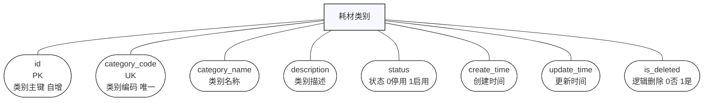

| 关联方向 | 关联实体 | 外键字段 | 基数 |
|----------|----------|----------|------|
| → 分类 | 耗材 | `category_id` | 1:N |

### 耗材（consumable）

```mermaid
flowchart TB
    er8_entity["耗材"]
    er8_attr1(["id<br/>PK<br/>耗材主键 自增"])
    er8_entity --- er8_attr1
    er8_attr2(["laboratory_id<br/>FK<br/>所属实验室ID"])
    er8_entity --- er8_attr2
    er8_attr3(["category_id<br/>FK<br/>耗材类别ID"])
    er8_entity --- er8_attr3
    er8_attr4(["manager_user_id<br/>FK<br/>耗材责任人ID"])
    er8_entity --- er8_attr4
    er8_attr5(["consumable_code<br/>UK<br/>耗材编号 唯一"])
    er8_entity --- er8_attr5
    er8_attr6(["consumable_name<br/>耗材名称"])
    er8_entity --- er8_attr6
    er8_attr7(["specification<br/>规格型号"])
    er8_entity --- er8_attr7
    er8_attr8(["unit<br/>计量单位"])
    er8_entity --- er8_attr8
    er8_attr9(["unit_price<br/>参考单价 元"])
    er8_entity --- er8_attr9
    er8_attr10(["safety_stock<br/>安全库存阈值"])
    er8_entity --- er8_attr10
    er8_attr11(["max_stock<br/>最大库存阈值"])
    er8_entity --- er8_attr11
    er8_attr12(["storage_location<br/>存放位置"])
    er8_entity --- er8_attr12
    er8_attr13(["expiry_required<br/>是否需效期管理 0否1是"])
    er8_entity --- er8_attr13
    er8_attr14(["status<br/>状态 0停用 1启用"])
    er8_entity --- er8_attr14
    er8_attr15(["remarks<br/>备注"])
    er8_entity --- er8_attr15
    er8_attr16(["create_time<br/>创建时间"])
    er8_entity --- er8_attr16
    er8_attr17(["update_time<br/>更新时间"])
    er8_entity --- er8_attr17
    er8_attr18(["is_deleted<br/>逻辑删除 0否 1是"])
    er8_entity --- er8_attr18
    classDef entity fill:#f7f7ff,stroke:#333,stroke-width:1.5px;
    classDef attr fill:#fff,stroke:#333,stroke-width:1px;
    class er8_entity entity;
    class er8_attr1,er8_attr2,er8_attr3,er8_attr4,er8_attr5,er8_attr6,er8_attr7,er8_attr8,er8_attr9,er8_attr10,er8_attr11,er8_attr12,er8_attr13,er8_attr14,er8_attr15,er8_attr16,er8_attr17,er8_attr18 attr;
```

| 关联方向 | 关联实体 | 外键字段 | 基数 |
|----------|----------|----------|------|
| → 属于 | 实验室 | `laboratory_id` | N:1 |
| → 分类 | 耗材类别 | `category_id` | N:1 |
| → 管理员 | 用户 | `manager_user_id` | N:1 |
| → 入库 | 耗材入库 | `consumable_id` | 1:N |
| → 出库 | 耗材出库 | `consumable_id` | 1:N |
| → 库存批次 | 库存 | `item_id` | 1:N |

### 危化品（hazardous_material）

```mermaid
flowchart TB
    er9_entity["危化品"]
    er9_attr1(["id<br/>PK<br/>危化品主键 自增"])
    er9_entity --- er9_attr1
    er9_attr2(["laboratory_id<br/>FK<br/>所属实验室ID"])
    er9_entity --- er9_attr2
    er9_attr3(["manager_user_id<br/>FK<br/>危化品责任人ID"])
    er9_entity --- er9_attr3
    er9_attr4(["hazardous_code<br/>UK<br/>危化品编号 唯一"])
    er9_entity --- er9_attr4
    er9_attr5(["material_name<br/>危化品名称"])
    er9_entity --- er9_attr5
    er9_attr6(["cas_no<br/>CAS编号"])
    er9_entity --- er9_attr6
    er9_attr7(["hazard_category<br/>危险类别"])
    er9_entity --- er9_attr7
    er9_attr8(["specification<br/>规格型号"])
    er9_entity --- er9_attr8
    er9_attr9(["unit<br/>计量单位"])
    er9_entity --- er9_attr9
    er9_attr10(["concentration<br/>浓度或纯度"])
    er9_entity --- er9_attr10
    er9_attr11(["storage_location<br/>存放位置"])
    er9_entity --- er9_attr11
    er9_attr12(["safety_stock<br/>安全库存阈值"])
    er9_entity --- er9_attr12
    er9_attr13(["msds_code<br/>MSDS编号"])
    er9_entity --- er9_attr13
    er9_attr14(["status<br/>状态 0停用 1启用"])
    er9_entity --- er9_attr14
    er9_attr15(["remarks<br/>备注"])
    er9_entity --- er9_attr15
    er9_attr16(["create_time<br/>创建时间"])
    er9_entity --- er9_attr16
    er9_attr17(["update_time<br/>更新时间"])
    er9_entity --- er9_attr17
    er9_attr18(["is_deleted<br/>逻辑删除 0否 1是"])
    er9_entity --- er9_attr18
    classDef entity fill:#f7f7ff,stroke:#333,stroke-width:1.5px;
    classDef attr fill:#fff,stroke:#333,stroke-width:1px;
    class er9_entity entity;
    class er9_attr1,er9_attr2,er9_attr3,er9_attr4,er9_attr5,er9_attr6,er9_attr7,er9_attr8,er9_attr9,er9_attr10,er9_attr11,er9_attr12,er9_attr13,er9_attr14,er9_attr15,er9_attr16,er9_attr17,er9_attr18 attr;
```

| 关联方向 | 关联实体 | 外键字段 | 基数 |
|----------|----------|----------|------|
| → 属于 | 实验室 | `laboratory_id` | N:1 |
| → 管理员 | 用户 | `manager_user_id` | N:1 |
| → 使用 | 危化品使用 | `hazardous_material_id` | 1:N |
| → 库存批次 | 库存 | `item_id` | 1:N |

### 设备借用（equipment_borrow）

```mermaid
flowchart TB
    er10_entity["设备借用"]
    er10_attr1(["id<br/>PK<br/>借用记录主键 自增"])
    er10_entity --- er10_attr1
    er10_attr2(["equipment_id<br/>FK<br/>设备ID"])
    er10_entity --- er10_attr2
    er10_attr3(["laboratory_id<br/>FK<br/>实验室ID"])
    er10_entity --- er10_attr3
    er10_attr4(["borrower_user_id<br/>FK<br/>借用人ID"])
    er10_entity --- er10_attr4
    er10_attr5(["approver_user_id<br/>FK<br/>审批人ID"])
    er10_entity --- er10_attr5
    er10_attr6(["purpose<br/>借用用途"])
    er10_entity --- er10_attr6
    er10_attr7(["borrow_date<br/>借用时间"])
    er10_entity --- er10_attr7
    er10_attr8(["due_date<br/>应还时间"])
    er10_entity --- er10_attr8
    er10_attr9(["actual_return_date<br/>实际归还时间"])
    er10_entity --- er10_attr9
    er10_attr10(["borrow_status<br/>状态 0待审批1借出2已归还3逾期"])
    er10_entity --- er10_attr10
    er10_attr11(["return_condition<br/>归还情况"])
    er10_entity --- er10_attr11
    er10_attr12(["remarks<br/>备注"])
    er10_entity --- er10_attr12
    er10_attr13(["create_time<br/>创建时间"])
    er10_entity --- er10_attr13
    er10_attr14(["update_time<br/>更新时间"])
    er10_entity --- er10_attr14
    er10_attr15(["is_deleted<br/>逻辑删除 0否 1是"])
    er10_entity --- er10_attr15
    classDef entity fill:#f7f7ff,stroke:#333,stroke-width:1.5px;
    classDef attr fill:#fff,stroke:#333,stroke-width:1px;
    class er10_entity entity;
    class er10_attr1,er10_attr2,er10_attr3,er10_attr4,er10_attr5,er10_attr6,er10_attr7,er10_attr8,er10_attr9,er10_attr10,er10_attr11,er10_attr12,er10_attr13,er10_attr14,er10_attr15 attr;
```

| 关联方向 | 关联实体 | 外键字段 | 基数 |
|----------|----------|----------|------|
| → 设备 | 设备 | `equipment_id` | N:1 |
| → 实验室 | 实验室 | `laboratory_id` | N:1 |
| → 借用人 | 用户 | `borrower_user_id` | N:1 |
| → 审批人 | 用户 | `approver_user_id` | N:1 |

### 设备维修（equipment_repair）

```mermaid
flowchart TB
    er11_entity["设备维修"]
    er11_attr1(["id<br/>PK<br/>维修记录主键 自增"])
    er11_entity --- er11_attr1
    er11_attr2(["equipment_id<br/>FK<br/>设备ID"])
    er11_entity --- er11_attr2
    er11_attr3(["laboratory_id<br/>FK<br/>实验室ID"])
    er11_entity --- er11_attr3
    er11_attr4(["reporter_user_id<br/>FK<br/>报修人ID"])
    er11_entity --- er11_attr4
    er11_attr5(["repair_user_id<br/>FK<br/>处理人ID"])
    er11_entity --- er11_attr5
    er11_attr6(["fault_description<br/>故障描述"])
    er11_entity --- er11_attr6
    er11_attr7(["report_time<br/>报修时间"])
    er11_entity --- er11_attr7
    er11_attr8(["repair_start_time<br/>维修开始时间"])
    er11_entity --- er11_attr8
    er11_attr9(["repair_end_time<br/>维修结束时间"])
    er11_entity --- er11_attr9
    er11_attr10(["repair_status<br/>状态 0待维修1维修中2已完成3无法修复"])
    er11_entity --- er11_attr10
    er11_attr11(["repair_cost<br/>维修费用 元"])
    er11_entity --- er11_attr11
    er11_attr12(["repair_result<br/>维修结果"])
    er11_entity --- er11_attr12
    er11_attr13(["remarks<br/>备注"])
    er11_entity --- er11_attr13
    er11_attr14(["create_time<br/>创建时间"])
    er11_entity --- er11_attr14
    er11_attr15(["update_time<br/>更新时间"])
    er11_entity --- er11_attr15
    er11_attr16(["is_deleted<br/>逻辑删除 0否 1是"])
    er11_entity --- er11_attr16
    classDef entity fill:#f7f7ff,stroke:#333,stroke-width:1.5px;
    classDef attr fill:#fff,stroke:#333,stroke-width:1px;
    class er11_entity entity;
    class er11_attr1,er11_attr2,er11_attr3,er11_attr4,er11_attr5,er11_attr6,er11_attr7,er11_attr8,er11_attr9,er11_attr10,er11_attr11,er11_attr12,er11_attr13,er11_attr14,er11_attr15,er11_attr16 attr;
```

| 关联方向 | 关联实体 | 外键字段 | 基数 |
|----------|----------|----------|------|
| → 设备 | 设备 | `equipment_id` | N:1 |
| → 实验室 | 实验室 | `laboratory_id` | N:1 |
| → 报修人 | 用户 | `reporter_user_id` | N:1 |
| → 维修人 | 用户 | `repair_user_id` | N:1 |

### 设备校准（equipment_calibration）

```mermaid
flowchart TB
    er12_entity["设备校准"]
    er12_attr1(["id<br/>PK<br/>校准记录主键 自增"])
    er12_entity --- er12_attr1
    er12_attr2(["equipment_id<br/>FK<br/>设备ID"])
    er12_entity --- er12_attr2
    er12_attr3(["laboratory_id<br/>FK<br/>实验室ID"])
    er12_entity --- er12_attr3
    er12_attr4(["calibration_user_id<br/>FK<br/>校准登记人ID"])
    er12_entity --- er12_attr4
    er12_attr5(["certificate_no<br/>校准证书编号"])
    er12_entity --- er12_attr5
    er12_attr6(["calibration_date<br/>校准日期"])
    er12_entity --- er12_attr6
    er12_attr7(["valid_until<br/>有效期至"])
    er12_entity --- er12_attr7
    er12_attr8(["calibration_result<br/>校准结果"])
    er12_entity --- er12_attr8
    er12_attr9(["calibration_status<br/>状态 0待校准1校准中2已完成"])
    er12_entity --- er12_attr9
    er12_attr10(["remarks<br/>备注"])
    er12_entity --- er12_attr10
    er12_attr11(["create_time<br/>创建时间"])
    er12_entity --- er12_attr11
    er12_attr12(["update_time<br/>更新时间"])
    er12_entity --- er12_attr12
    er12_attr13(["is_deleted<br/>逻辑删除 0否 1是"])
    er12_entity --- er12_attr13
    classDef entity fill:#f7f7ff,stroke:#333,stroke-width:1.5px;
    classDef attr fill:#fff,stroke:#333,stroke-width:1px;
    class er12_entity entity;
    class er12_attr1,er12_attr2,er12_attr3,er12_attr4,er12_attr5,er12_attr6,er12_attr7,er12_attr8,er12_attr9,er12_attr10,er12_attr11,er12_attr12,er12_attr13 attr;
```

| 关联方向 | 关联实体 | 外键字段 | 基数 |
|----------|----------|----------|------|
| → 设备 | 设备 | `equipment_id` | N:1 |
| → 实验室 | 实验室 | `laboratory_id` | N:1 |
| → 校准人 | 用户 | `calibration_user_id` | N:1 |

### 耗材入库（consumable_inbound）

```mermaid
flowchart TB
    er13_entity["耗材入库"]
    er13_attr1(["id<br/>PK<br/>入库记录主键 自增"])
    er13_entity --- er13_attr1
    er13_attr2(["consumable_id<br/>FK<br/>耗材ID"])
    er13_entity --- er13_attr2
    er13_attr3(["laboratory_id<br/>FK<br/>实验室ID"])
    er13_entity --- er13_attr3
    er13_attr4(["operator_user_id<br/>FK<br/>操作人ID"])
    er13_entity --- er13_attr4
    er13_attr5(["batch_no<br/>批次号"])
    er13_entity --- er13_attr5
    er13_attr6(["inbound_type<br/>入库类型 1采购2调拨3盘盈"])
    er13_entity --- er13_attr6
    er13_attr7(["quantity<br/>入库数量"])
    er13_entity --- er13_attr7
    er13_attr8(["unit_price<br/>单价 元"])
    er13_entity --- er13_attr8
    er13_attr9(["total_amount<br/>总金额 元"])
    er13_entity --- er13_attr9
    er13_attr10(["production_date<br/>生产日期"])
    er13_entity --- er13_attr10
    er13_attr11(["expiry_date<br/>过期日期"])
    er13_entity --- er13_attr11
    er13_attr12(["supplier_name<br/>供应商名称"])
    er13_entity --- er13_attr12
    er13_attr13(["inbound_date<br/>入库日期"])
    er13_entity --- er13_attr13
    er13_attr14(["remarks<br/>备注"])
    er13_entity --- er13_attr14
    er13_attr15(["create_time<br/>创建时间"])
    er13_entity --- er13_attr15
    er13_attr16(["update_time<br/>更新时间"])
    er13_entity --- er13_attr16
    er13_attr17(["is_deleted<br/>逻辑删除 0否 1是"])
    er13_entity --- er13_attr17
    classDef entity fill:#f7f7ff,stroke:#333,stroke-width:1.5px;
    classDef attr fill:#fff,stroke:#333,stroke-width:1px;
    class er13_entity entity;
    class er13_attr1,er13_attr2,er13_attr3,er13_attr4,er13_attr5,er13_attr6,er13_attr7,er13_attr8,er13_attr9,er13_attr10,er13_attr11,er13_attr12,er13_attr13,er13_attr14,er13_attr15,er13_attr16,er13_attr17 attr;
```

| 关联方向 | 关联实体 | 外键字段 | 基数 |
|----------|----------|----------|------|
| → 耗材 | 耗材 | `consumable_id` | N:1 |
| → 实验室 | 实验室 | `laboratory_id` | N:1 |
| → 操作人 | 用户 | `operator_user_id` | N:1 |

### 耗材出库（consumable_outbound）

```mermaid
flowchart TB
    er14_entity["耗材出库"]
    er14_attr1(["id<br/>PK<br/>出库记录主键 自增"])
    er14_entity --- er14_attr1
    er14_attr2(["consumable_id<br/>FK<br/>耗材ID"])
    er14_entity --- er14_attr2
    er14_attr3(["laboratory_id<br/>FK<br/>实验室ID"])
    er14_entity --- er14_attr3
    er14_attr4(["applicant_user_id<br/>FK<br/>申领人ID"])
    er14_entity --- er14_attr4
    er14_attr5(["approver_user_id<br/>FK<br/>审批人ID"])
    er14_entity --- er14_attr5
    er14_attr6(["operator_user_id<br/>FK<br/>操作人ID"])
    er14_entity --- er14_attr6
    er14_attr7(["batch_no<br/>出库批次号"])
    er14_entity --- er14_attr7
    er14_attr8(["outbound_type<br/>出库类型 1教学2科研3维护"])
    er14_entity --- er14_attr8
    er14_attr9(["quantity<br/>出库数量"])
    er14_entity --- er14_attr9
    er14_attr10(["unit_price<br/>出库单价 元"])
    er14_entity --- er14_attr10
    er14_attr11(["total_amount<br/>出库总金额 元"])
    er14_entity --- er14_attr11
    er14_attr12(["outbound_date<br/>出库日期"])
    er14_entity --- er14_attr12
    er14_attr13(["purpose<br/>出库用途"])
    er14_entity --- er14_attr13
    er14_attr14(["outbound_status<br/>状态 0待审批1已出库2已拒绝"])
    er14_entity --- er14_attr14
    er14_attr15(["remarks<br/>备注"])
    er14_entity --- er14_attr15
    er14_attr16(["create_time<br/>创建时间"])
    er14_entity --- er14_attr16
    er14_attr17(["update_time<br/>更新时间"])
    er14_entity --- er14_attr17
    er14_attr18(["is_deleted<br/>逻辑删除 0否 1是"])
    er14_entity --- er14_attr18
    classDef entity fill:#f7f7ff,stroke:#333,stroke-width:1.5px;
    classDef attr fill:#fff,stroke:#333,stroke-width:1px;
    class er14_entity entity;
    class er14_attr1,er14_attr2,er14_attr3,er14_attr4,er14_attr5,er14_attr6,er14_attr7,er14_attr8,er14_attr9,er14_attr10,er14_attr11,er14_attr12,er14_attr13,er14_attr14,er14_attr15,er14_attr16,er14_attr17,er14_attr18 attr;
```

| 关联方向 | 关联实体 | 外键字段 | 基数 |
|----------|----------|----------|------|
| → 耗材 | 耗材 | `consumable_id` | N:1 |
| → 实验室 | 实验室 | `laboratory_id` | N:1 |
| → 申领人 | 用户 | `applicant_user_id` | N:1 |
| → 审批人 | 用户 | `approver_user_id` | N:1 |
| → 操作人 | 用户 | `operator_user_id` | N:1 |

### 危化品使用（hazardous_usage）

```mermaid
flowchart TB
    er15_entity["危化品使用"]
    er15_attr1(["id<br/>PK<br/>使用记录主键 自增"])
    er15_entity --- er15_attr1
    er15_attr2(["hazardous_material_id<br/>FK<br/>危化品ID"])
    er15_entity --- er15_attr2
    er15_attr3(["laboratory_id<br/>FK<br/>实验室ID"])
    er15_entity --- er15_attr3
    er15_attr4(["applicant_user_id<br/>FK<br/>申请人ID"])
    er15_entity --- er15_attr4
    er15_attr5(["approver_user_id<br/>FK<br/>审批人ID"])
    er15_entity --- er15_attr5
    er15_attr6(["operator_user_id<br/>FK<br/>操作人ID"])
    er15_entity --- er15_attr6
    er15_attr7(["action_type<br/>动作 1入库2领用3归还4废液处理"])
    er15_entity --- er15_attr7
    er15_attr8(["batch_no<br/>批次号"])
    er15_entity --- er15_attr8
    er15_attr9(["quantity<br/>数量"])
    er15_entity --- er15_attr9
    er15_attr10(["remaining_quantity<br/>剩余或归还数量"])
    er15_entity --- er15_attr10
    er15_attr11(["usage_date<br/>业务日期"])
    er15_entity --- er15_attr11
    er15_attr12(["purpose<br/>用途"])
    er15_entity --- er15_attr12
    er15_attr13(["project_name<br/>实验项目名称"])
    er15_entity --- er15_attr13
    er15_attr14(["witness_name<br/>见证人 复核人"])
    er15_entity --- er15_attr14
    er15_attr15(["usage_status<br/>状态 0待审批1已完成2已拒绝"])
    er15_entity --- er15_attr15
    er15_attr16(["remarks<br/>备注"])
    er15_entity --- er15_attr16
    er15_attr17(["create_time<br/>创建时间"])
    er15_entity --- er15_attr17
    er15_attr18(["update_time<br/>更新时间"])
    er15_entity --- er15_attr18
    er15_attr19(["is_deleted<br/>逻辑删除 0否 1是"])
    er15_entity --- er15_attr19
    classDef entity fill:#f7f7ff,stroke:#333,stroke-width:1.5px;
    classDef attr fill:#fff,stroke:#333,stroke-width:1px;
    class er15_entity entity;
    class er15_attr1,er15_attr2,er15_attr3,er15_attr4,er15_attr5,er15_attr6,er15_attr7,er15_attr8,er15_attr9,er15_attr10,er15_attr11,er15_attr12,er15_attr13,er15_attr14,er15_attr15,er15_attr16,er15_attr17,er15_attr18,er15_attr19 attr;
```

| 关联方向 | 关联实体 | 外键字段 | 基数 |
|----------|----------|----------|------|
| → 危化品 | 危化品 | `hazardous_material_id` | N:1 |
| → 实验室 | 实验室 | `laboratory_id` | N:1 |
| → 申请人 | 用户 | `applicant_user_id` | N:1 |
| → 审批人 | 用户 | `approver_user_id` | N:1 |
| → 操作人 | 用户 | `operator_user_id` | N:1 |

### 库存（inventory）

```mermaid
flowchart TB
    er16_entity["库存"]
    er16_attr1(["id<br/>PK<br/>库存主键 自增"])
    er16_entity --- er16_attr1
    er16_attr2(["laboratory_id<br/>FK<br/>实验室ID"])
    er16_entity --- er16_attr2
    er16_attr3(["item_type<br/>物资类型 1耗材 2危化品"])
    er16_entity --- er16_attr3
    er16_attr4(["item_id<br/>物资ID 多态关联"])
    er16_entity --- er16_attr4
    er16_attr5(["batch_no<br/>批次号"])
    er16_entity --- er16_attr5
    er16_attr6(["quantity<br/>当前库存数量"])
    er16_entity --- er16_attr6
    er16_attr7(["locked_quantity<br/>锁定数量"])
    er16_entity --- er16_attr7
    er16_attr8(["unit_price<br/>单价 元"])
    er16_entity --- er16_attr8
    er16_attr9(["production_date<br/>生产日期"])
    er16_entity --- er16_attr9
    er16_attr10(["expiry_date<br/>过期日期"])
    er16_entity --- er16_attr10
    er16_attr11(["last_stock_in_time<br/>最近入库时间"])
    er16_entity --- er16_attr11
    er16_attr12(["last_stock_out_time<br/>最近出库时间"])
    er16_entity --- er16_attr12
    er16_attr13(["warning_status<br/>预警 0正常1不足2临期3过期"])
    er16_entity --- er16_attr13
    er16_attr14(["remarks<br/>备注"])
    er16_entity --- er16_attr14
    er16_attr15(["create_time<br/>创建时间"])
    er16_entity --- er16_attr15
    er16_attr16(["update_time<br/>更新时间"])
    er16_entity --- er16_attr16
    er16_attr17(["is_deleted<br/>逻辑删除 0否 1是"])
    er16_entity --- er16_attr17
    classDef entity fill:#f7f7ff,stroke:#333,stroke-width:1.5px;
    classDef attr fill:#fff,stroke:#333,stroke-width:1px;
    class er16_entity entity;
    class er16_attr1,er16_attr2,er16_attr3,er16_attr4,er16_attr5,er16_attr6,er16_attr7,er16_attr8,er16_attr9,er16_attr10,er16_attr11,er16_attr12,er16_attr13,er16_attr14,er16_attr15,er16_attr16,er16_attr17 attr;
```

| 关联方向 | 关联实体 | 外键字段 | 基数 |
|----------|----------|----------|------|
| → 实验室 | 实验室 | `laboratory_id` | N:1 |
| → 耗材 | 耗材 | `item_id` | N:1 |
| → 危化品 | 危化品 | `item_id` | N:1 |

### 系统日志（system_log）

```mermaid
flowchart TB
    er17_entity["系统日志"]
    er17_attr1(["id<br/>PK<br/>日志主键 自增"])
    er17_entity --- er17_attr1
    er17_attr2(["user_id<br/>FK<br/>操作用户ID"])
    er17_entity --- er17_attr2
    er17_attr3(["laboratory_id<br/>FK<br/>关联实验室ID"])
    er17_entity --- er17_attr3
    er17_attr4(["module_name<br/>操作模块"])
    er17_entity --- er17_attr4
    er17_attr5(["operation_type<br/>操作类型"])
    er17_entity --- er17_attr5
    er17_attr6(["business_key<br/>业务主键"])
    er17_entity --- er17_attr6
    er17_attr7(["operation_desc<br/>操作描述"])
    er17_entity --- er17_attr7
    er17_attr8(["request_ip<br/>请求IP"])
    er17_entity --- er17_attr8
    er17_attr9(["operation_status<br/>状态 0失败 1成功"])
    er17_entity --- er17_attr9
    er17_attr10(["operation_time<br/>操作时间"])
    er17_entity --- er17_attr10
    er17_attr11(["create_time<br/>创建时间"])
    er17_entity --- er17_attr11
    er17_attr12(["update_time<br/>更新时间"])
    er17_entity --- er17_attr12
    er17_attr13(["is_deleted<br/>逻辑删除 0否 1是"])
    er17_entity --- er17_attr13
    classDef entity fill:#f7f7ff,stroke:#333,stroke-width:1.5px;
    classDef attr fill:#fff,stroke:#333,stroke-width:1px;
    class er17_entity entity;
    class er17_attr1,er17_attr2,er17_attr3,er17_attr4,er17_attr5,er17_attr6,er17_attr7,er17_attr8,er17_attr9,er17_attr10,er17_attr11,er17_attr12,er17_attr13 attr;
```

| 关联方向 | 关联实体 | 外键字段 | 基数 |
|----------|----------|----------|------|
| → 用户 | 用户 | `user_id` | N:1 |
| → 实验室 | 实验室 | `laboratory_id` | N:1 |

### 关联表

#### 用户角色关联（user_role）

| 字段 | 类型 | 说明 |
|------|------|------|
| id | BIGINT | PK |
| user_id | BIGINT | FK→用户 |
| role_id | BIGINT | FK→角色 |

#### 角色菜单关联（role_menu）

| 字段 | 类型 | 说明 |
|------|------|------|
| id | BIGINT | PK |
| role_id | BIGINT | FK→角色 |
| menu_id | BIGINT | FK→菜单 |

---

## 数据库逻辑设计规范

### 通用字段

所有实体表统一包含：

| 字段 | 类型 | 说明 |
|------|------|------|
| create_time | DATETIME | 创建时间 |
| update_time | DATETIME | 更新时间 |
| is_deleted | TINYINT | 逻辑删除，默认 0 |

### 约束策略

| 约束 | 策略 |
|------|------|
| 主键 | BIGINT 自增 |
| 外键 | ON UPDATE CASCADE，删除 RESTRICT 或 SET NULL |
| 唯一 | 编号、用户名、角色编码等编码字段 |
| CHECK | 数量≥0、金额≥0、结束时间≥开始时间、过期≥生产 |
| NOT NULL | 名称、编号、状态、日期等核心字段 |

### 关键索引

| 表 | 索引字段 | 类型 |
|----|----------|------|
| equipment | `equipment_code` | UNIQUE |
| equipment | `status` | INDEX |
| consumable | `consumable_code` | UNIQUE |
| hazardous_material | `hazardous_code` | UNIQUE |
| equipment_borrow | `(laboratory_id, borrow_status, due_date)` | 复合 |
| consumable_outbound | `(consumable_id, outbound_date)` | 复合 |
| hazardous_usage | `(hazardous_material_id, action_type, usage_date)` | 复合 |
| inventory | `(item_type, item_id, batch_no)` | 复合 |
| inventory | `warning_status` | INDEX |
| inventory | `expiry_date` | INDEX |

---

## 视图、存储过程与触发器

### 视图

| 视图名 | 说明 |
|--------|------|
| `v_equipment_borrow_status` | 联表查询设备借用概况 |
| `v_consumable_inventory_status` | 汇总耗材库存状态 |
| `v_hazardous_material_usage_summary` | 汇总危化品使用/归还/废液处理 |

### 存储过程

| 存储过程 | 说明 |
|----------|------|
| `sp_equipment_borrow` | 校验设备状态并生成借用记录 |
| `sp_consumable_outbound` | 校验库存并生成出库记录 |
| `sp_consumable_yearly_stats` | 按年份统计各耗材分类领用数量 |

### 触发器

| 触发器 | 时机 | 说明 |
|--------|------|------|
| `trg_after_equipment_borrow` | AFTER INSERT ON 设备借用 | 设备状态→借出 |
| `trg_after_borrow_return` | AFTER UPDATE ON 设备借用 | 设备状态→可用 + 审计日志 |
| `trg_after_consumable_inbound` | AFTER INSERT ON 耗材入库 | 新增/更新库存批次 |
| `trg_after_consumable_outbound` | AFTER INSERT ON 耗材出库 | 扣减库存数量 |
| `trg_after_hazardous_usage` | AFTER INSERT ON 危化品使用 | 按 action_type 更新库存 |
| `trg_equipment_status_change_log` | AFTER UPDATE ON 设备 | 状态变化→系统日志 |

## 数据库设计特点

- 所有业务表统一包含 `create_time`、`update_time`、`is_deleted`
- 状态字段统一使用 `TINYINT`
- 编码字段 UNIQUE KEY 约束
- 外键保证数据关系一致
- 触发器自动维护库存和设备状态
- 视图提升联表查询效率
- 3NF：主数据与流水分离，分类独立成表
- 初始化脚本不含业务演示数据

## 当前已实现功能

- JWT 登录鉴权与 RBAC 权限控制
- 数据库驱动菜单、父子级菜单、按钮级权限
- 实验室、用户、设备分类、设备、耗材分类、耗材、危化品基础 CRUD
- 设备借用与归还
- 耗材入库、耗材出库
- 危化品领用、归还、废液处理登记
- 设备维修、设备校准
- 库存预警
- 仪表盘统计图表与到期提醒
- 报表中心多维筛选与 CSV 导出
- 操作审计日志
- 数据库增量迁移脚本、视图、存储过程、触发器
